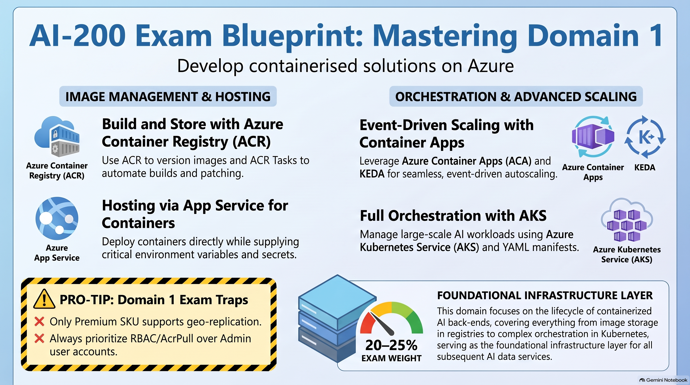
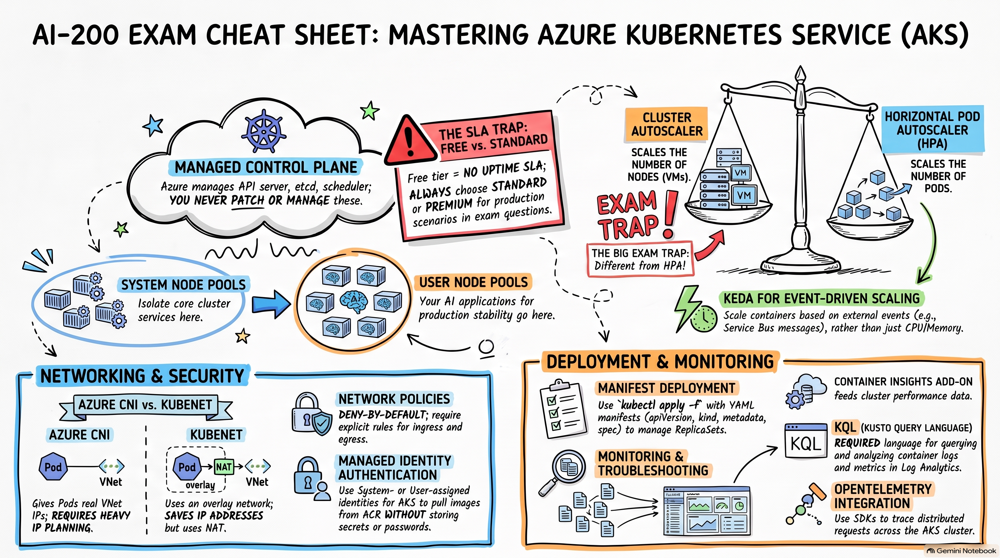

# Develop containerized solutions on Azure (20–25%)



Hosting and orchestrating container images, scaling, and troubleshooting.

Official split:

| Skill area | What it covers |
| --- | --- |
| **Implement container application hosting** | ACR, ACR Tasks, App Service for Containers |
| **Implement container-orchestrated solutions** | ACA + KEDA, AKS manifests, logs / events / connectivity |

Pick the host by how much Kubernetes you want:

| Host | You manage | Best for |
| --- | --- | --- |
| App Service for Containers | Almost nothing | One web app (or simple Compose) |
| Azure Container Apps | Env, revisions, scale rules | Microservices, event-driven jobs, scale-to-zero |
| AKS | Cluster + YAML | Full Kubernetes control |

ACI (Container Instances) is **not** a Domain 1 bullet. Do not pick it when the question is about revisions, KEDA, or manifests.

---

## 1. Azure Container Registry (ACR) and ACR Tasks

Private Docker registry for storing, versioning, and deploying images.

### 1.1 SKU tiers

| Tier | Use |
| --- | --- |
| **Basic** | Entry-level, dev/test |
| **Standard** | Mid-size production |
| **Premium** | Geo-replication, private endpoints / Private Link, customer-managed keys, content trust, dedicated data endpoints, zone redundancy, higher throughput |

If the scenario says **geo-replication** or **private endpoint**, the answer is **Premium**. Standard cannot do those.

### 1.2 Authentication and RBAC

Production pattern: **managed identity + `AcrPull`**. Do not use the registry admin user.

| Role / method | What it allows |
| --- | --- |
| `AcrPull` | Pull only |
| `AcrPush` | Pull and push |
| `Contributor` / `Owner` on the registry resource | Control plane only — **does not** grant image pull |
| Tokens + scope maps | Repo-scoped pull/push (not admin user) |

Image access is **data-plane** (`AcrPull` / `AcrPush` or a scoped token).

AKS / ACA / App Service pull from ACR with a user-assigned or system-assigned identity that has `AcrPull`. AKS can also use the kubelet identity or an image-pull secret; **identity is the exam answer**.

### 1.3 Image tagging

Avoid `:latest` in production. It is mutable, so rollbacks and slot swaps become guesswork.

Prefer:

- Semantic tags (`1.4.2`)
- Unique tags (git SHA)
- Digest pin (`@sha256:...`) when you need an immutable pull

### 1.4 ACR Tasks

Build in Azure so you do not need Docker on a laptop or in CI agents.

| Task type | What it does |
| --- | --- |
| **Quick tasks** | On-demand build and push: `az acr build` |
| **Automated triggers** | Git commit / PR, cron, or **base-image update** (rebuild when `python:3.12` gets a patch) |
| **Multi-step tasks** | YAML that chains build → test → push |

```text
az acr build  →  uploads context to ACR  →  build runs in Azure
docker build + docker push  →  local path
```

Exam prefers ACR Tasks when the goal is “build in Azure” or “rebuild when the base image changes.”

---

## 2. Azure App Service for Containers

Fully managed PaaS. Best for a **single web container**, or a simple multi-container **Compose** setup, with almost no cluster work.

### 2.1 Config and secrets

- **App settings** become environment variables inside the container.
- **Key Vault references + managed identity** is the preferred way to inject secrets. Do not bake secrets into the image or put them in plain app settings if Key Vault is an option.
- Container listen port: set `WEBSITES_PORT` (or `PORT`) to the port the process actually binds. Wrong port = app never becomes healthy.

### 2.2 Deployment slots

- Slots give a staging environment and a swap for near-zero downtime.
- Settings that must **not** swap (DB connection, slot hostname, slot-specific secrets): mark them **slot-specific** / sticky.
- That is the usual exam answer for “connection string changed after swap.”
- Swap is a traffic cutover of the already-running slot, **not** a new image build.

App Service is the wrong pick when you need scale-to-zero, KEDA scalers, or many microservices with per-service revisions.

---

## 3. Azure Container Apps (ACA) and KEDA

Fully managed serverless containers on Kubernetes, KEDA, Envoy, and optional Dapr. You do not manage nodes or YAML for Deployments.


### 3.1 Environment

Apps live in a **Container Apps environment** (shared networking, logging, Dapr).

| Plan | Idea |
| --- | --- |
| **Consumption** | Pay per use, scale to zero |
| **Workload profiles** | Dedicated compute for predictable CPU/memory, still with scale rules |

One environment, many apps. Apps in the same environment can talk over the internal mesh (`http://<app-name>`).

### 3.2 Apps vs jobs

| Type | Behavior | When to use |
| --- | --- | --- |
| **App** | Long-running (HTTP API, worker that stays up, min replicas ≥ 0) | Always-on HTTP / workers |
| **Job** | Run to completion: manual, scheduled (cron), or event-driven | “Process this queue message then exit” |

Do not use an always-on app with min replicas = 1 for a one-shot batch.

### 3.3 Revisions

A revision is an immutable snapshot of the container image + env + scale config.

```text
new image or config change → new revision
```

| Mode | Traffic |
| --- | --- |
| **Single revision** | Only one revision gets traffic (simple apps) |
| **Multiple revision** | Split traffic (10% / 90%) for canary / blue-green |

You do not “edit” a live revision. You create another one and shift traffic.

If the question is about canary or splitting traffic between two container versions **without AKS**, the answer is **ACA revisions + traffic weights**.

### 3.4 Ingress

| Ingress | Who can reach it |
| --- | --- |
| **External** | Public HTTPS |
| **Internal** | Only inside the environment / VNet |

- Ingress is Envoy in front of replicas. Target port must match the container.
- Ingress off = no HTTP URL. Most APIs want ingress on.

### 3.5 Secrets and identity

- Secrets at app scope, mapped as env vars or volume mounts
- Managed identity for ACR pull, Key Vault, Service Bus, Storage
- Dapr is optional sidecar (pub/sub, state, bindings). Do not turn it on unless the scenario needs it.

### 3.6 KEDA scaling

ACA scale rules are KEDA under the hood.

- **min replicas = 0** → scale to zero (HTTP or event) and pay nothing when idle
- **max replicas** → cap
- HTTP / TCP concurrent-request rules for APIs
- Event scalers: Service Bus queue/topic length, Event Hubs, Storage queues, Redis lists, Cron, CPU/memory

| Signal | Scale rule |
| --- | --- |
| HTTP request count / concurrency | HTTP scaler |
| Service Bus queue depth | KEDA Service Bus scaler |
| Nightly batch, then exit | Container Apps **job** + schedule or event |
| Always at least one replica | min replicas = 1 (no scale-to-zero) |

KEDA scales **replicas of the app**, not VM nodes. Node count is an AKS / cluster-autoscaler concern.

Polling interval and cooldown matter: a queue scaler that is too slow looks like “messages stuck.” Check scale rule auth (managed identity / connection) before blaming the image.

---

## 4. Azure Kubernetes Service (AKS)

Managed Kubernetes. You own the YAML: Deployments, Services, Ingress, probes, HPA.



### 4.1 Architecture

| Piece | Who manages it | Notes |
| --- | --- | --- |
| **Control plane** | Azure (API server, scheduler, etcd) | **Free** has no SLA. Production needs **Standard** or **Premium**. |
| **System node pool** | You (nodes), Azure add-ons | CoreDNS, metrics, CSI, kube-system. Taint so app pods stay off it. |
| **User node pool** | You | Application workloads |

Separate node pools for GPU, spot, or Windows. Do not mix system add-ons onto the only user pool if the question asks for isolation.

### 4.2 Deploy with manifests

Exam skill: deploy and manage with **manifest files**, not the portal click-ops story.

Typical set:

- `Namespace`
- `Deployment` (replicas, image, resources, probes)
- `Service` (`ClusterIP` internal, `LoadBalancer` public Azure LB)
- `Ingress` or Gateway API for HTTP routing
- `Secret` / `ConfigMap` (or CSI Secret Store for Key Vault)
- `HorizontalPodAutoscaler`

```text
kubectl apply -f
```

Update image by changing the tag in the Deployment and applying again, or `kubectl set image`.

| Probe | Job |
| --- | --- |
| **liveness** | Restart the container if it is dead |
| **readiness** | Take it out of the Service until it can take traffic |
| **startup** | Slow-starting apps (common for AI runtimes) |

Missing readiness probe is a classic “traffic hits pods that are still loading the model” failure.

### 4.3 Networking models

| Model | Pod addressing | When |
| --- | --- | --- |
| **Azure CNI** | Each pod gets a VNet IP | Other VNet resources can route to pods. Uses more IPs. |
| **Azure CNI Overlay** | Overlay IPs; nodes on the VNet | Fewer VNet IPs, still Azure CNI features. Common modern default. |
| **Kubenet** | Overlay + NAT | Smaller IP burn, less direct pod reachability, older pattern |

If pods must be directly reachable from a VNet (private DB firewall on pod IPs, NVA inspection), pick **Azure CNI**, not kubenet.

### 4.4 Autoscaling (do not mix these up)

| Mechanism | What it scales | When |
| --- | --- | --- |
| **HPA** | Pod replicas in a Deployment | CPU, memory, or custom metrics |
| **Cluster autoscaler** | **Nodes** in a node pool | Pods are `Pending` / unschedulable |
| **KEDA** (if installed) | Replicas from events | Queue length, etc. ACA has this built in; AKS you add it |
| **VPA** | CPU/memory **requests** on pods | Not a substitute for HPA |

```text
Pods Pending + Insufficient cpu
  → cluster autoscaler / bigger nodes
  → NOT HPA
```

HPA already wants more replicas; there is nowhere to put them.

### 4.5 Identity and ACR

Attach ACR with:

```bash
az aks update --attach-acr
```

That grants `AcrPull` on the kubelet / kubelet identity.

`ImagePullBackOff` + 401 from ACR is almost always missing `AcrPull` or wrong identity.

---

## 5. Monitor and troubleshoot (AKS and Container Apps)

The study guide calls this out on its own: inspect **logs**, **events**, and **end-to-end connectivity**.

### 5.1 Container Apps

| Tool / place | What you see |
| --- | --- |
| `az containerapp logs show` / console log stream | stdout/stderr of a replica |
| System logs | Revision activation, scale, probe failures |
| Environment → Log Analytics | Queries over history |
| Revision status | `Running` vs `Failed` vs `Stopped`; replica count |

Common ACA symptoms:

| Symptom | Likely cause |
| --- | --- |
| Replica count stuck at 0 + HTTP 503 | Ingress off, min replicas, failing startup probe, or image pull |
| Image pull errors | Identity + `AcrPull`, tag missing in registry |
| External ingress 404 / 502 | Wrong target port, app not on `0.0.0.0`, revision not getting traffic |
| App A cannot reach app B | B ingress internal, wrong app name, different environment |
| VNet-injected env cannot reach private PaaS | Azure Private DNS + NSGs (not “restart the container”) |

### 5.2 AKS

Order that matches how questions are written:

1. **Events** — `kubectl describe pod` / `kubectl get events`  
   ImagePullBackOff, CrashLoopBackOff, FailedScheduling, FailedMount show up here first.
2. **Logs** — `kubectl logs` (and `-p` for the previous crash)  
   App exceptions live here, not in events.
3. **Connectivity** — Service endpoints, NSG, UDR, CoreDNS, NetworkPolicy, private endpoint DNS

| Symptom | Look at |
| --- | --- |
| `ImagePullBackOff` | ACR auth, tag, `imagePullSecrets` / AcrPull |
| `CrashLoopBackOff` | Logs, command/args, required env, port |
| `Pending` | Resources, node selectors/taints, cluster autoscaler |
| 503 from LoadBalancer | Readiness probe, empty endpoints (`kubectl get endpoints`) |
| DNS fail inside pod | CoreDNS, VNet DNS, private zone links |
| Intermittent timeouts to Cosmos/Postgres | NSG, firewall IP of the **node** (kubenet/NAT) vs **pod** (CNI), SNAT ports |

```text
events first  →  pull / schedule failures
logs next     →  app crashes / exceptions
DNS / NSG     →  cannot connect
```

---

## 6. Exam cue sheet (Domain 1)

| Exam wording | Think |
| --- | --- |
| Contributor on ACR | **Does not pull images** — need `AcrPull` |
| Admin user on ACR | Never the production answer |
| `:latest` in production | Wrong tag strategy |
| Geo-replication / private endpoint for ACR | **Premium** |
| Connection string changed after slot swap | **Slot-specific / sticky settings** |
| Canary without managing a cluster | **ACA revisions + traffic split** |
| Run-to-completion batch | **ACA job** |
| HTTP that stays up | **ACA app** |
| Scale from queue depth on ACA | **KEDA scale rule** (replicas) |
| Nodes need to grow | **Cluster autoscaler** |
| More pods from CPU | **HPA** |
| Free AKS control plane | **No SLA** |
| Isolate system add-ons from apps | **System vs user node pools** |
| Pull/schedule failure | **Events first** |
| App exception / crash | **Logs** |
| Cannot connect to PaaS | **DNS / NSG** |
| Build image in Azure / rebuild on base update | **ACR Tasks** (`az acr build`) |
| Single web container, almost no ops | **App Service for Containers** |
| Scale to zero + microservices | **Azure Container Apps** |
| Full Kubernetes control + YAML | **AKS** |
