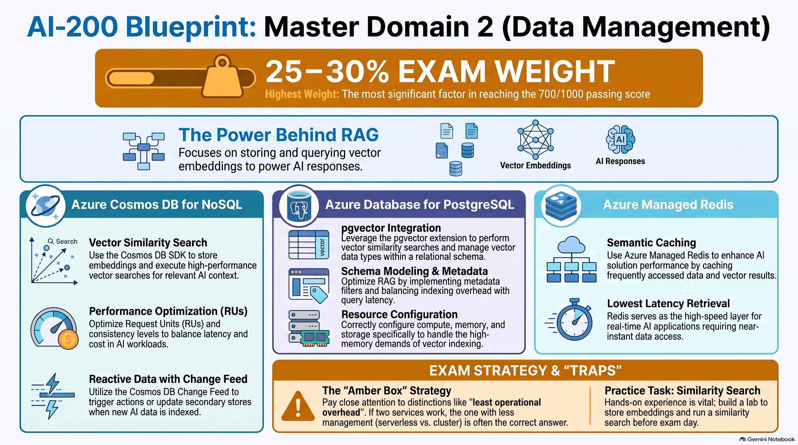
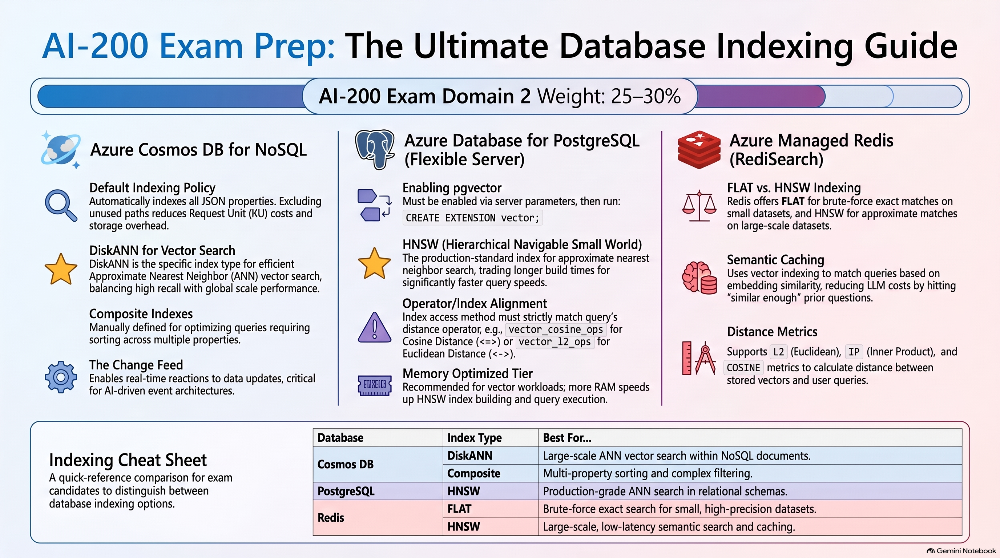

# AI solutions with Azure data management services



How an AI app stores data, stores embeddings, retrieves meaning, and caches results.

| Service | Main purpose | Vector capability |
| --- | --- | --- |
| Azure Cosmos DB for NoSQL | Globally distributed NoSQL / JSON database | Vector search + DiskANN |
| Azure Database for PostgreSQL | Relational SQL database | pgvector + HNSW |
| Azure Managed Redis | Fast in-memory store / cache | RediSearch + FLAT / HNSW |

Do not mix the indexes:

- Cosmos → **DiskANN**
- Postgres → **HNSW**
- Redis → **FLAT / HNSW**

---

## 1. Embeddings and vector search

### 1.1 What is an embedding?

An embedding converts something (usually text) into a list of numbers: a **vector**. The vector can have hundreds or thousands of dimensions.

```text
"I love cats" → [0.12, -0.44, 0.81, 0.32, ...]
```

The individual numbers are not the point. Position relative to other vectors is the point.

| Text | Vector |
| --- | --- |
| "I like dogs" | A |
| "I love puppies" | B |
| "How to repair SQL" | C |

A and B sit close together because the meaning is similar. C sits farther away.

**Embedding = numerical representation of meaning.** That is why an app can search by meaning instead of exact keywords.

### 1.2 Keyword search vs semantic search

User searches: *"How can I reduce my Azure bill?"*

The database has: *"Methods for lowering cloud computing costs."*

Keyword search can miss this because the words differ. Vector search can match them because:

- reduce bill ≈ lowering costs
- their embeddings are close

| Search type | What it matches |
| --- | --- |
| Traditional | Words → words |
| Vector | Meaning → meaning |

### 1.3 Vector similarity

Once data is a vector, you need a way to say how close two vectors are.

| Metric | Meaning |
| --- | --- |
| Cosine | Direction / angle |
| Euclidean / L2 | Straight-line distance |
| Inner product | Vector alignment |

Smaller distance usually means more similar (except when a product score is used as similarity instead of distance).

### 1.4 Vector search in four steps

Store path:

```text
document → embedding model → vector → store vector + original data
```

Query path:

```text
user question → embedding model → query vector → vector DB → similarity search → most similar documents
```

Both the stored documents **and** the user query must go through the same embedding process. Different models = different vector spaces = useless comparison.

---

## 2. Retrieval-augmented generation (RAG)

### 2.1 What is RAG?

Do not ask the LLM to answer only from training data. Retrieve your own data first, then generate. That retrieved text is **context**.

**Retrieve first → generate second.**

### 2.2 Why RAG?

The model may not know your latest internal facts. Retraining is expensive. RAG lets you keep company data in a store and pull it at ask-time.

Example: employee handbook.

```text
company documents → split into chunks → generate embeddings → store vectors
```

Employee asks: *"How many annual leave days do I have?"*

```text
question → embedding → vector search → relevant chunks → add chunks to prompt → LLM answers
```

### 2.3 Four exam steps of RAG

1. **Embed** the question  
   `"What is our refund policy?"` → embedding model → `[0.18, 0.75, ...]`
2. **Search** the vector store  
   Find top-N / top-k vectors closest to the question.
3. **Prompt**  
   Put retrieved company text + the question into the prompt.
4. **Generate**  
   Call the LLM so it answers from that context.

Memory: **E → S → P → G** (Embed, Search, Prompt, Generate)

### 2.4 Metadata filtering

Vector similarity alone is not enough when many tenants share one store.

| Document | Tenant |
| --- | --- |
| A | Tenant A |
| B | Tenant B |
| C | Tenant A |

If Tenant A asks, Tenant B’s docs must not appear. Combine **vector search + metadata filter**, for example `WHERE tenant = "TenantA"`, then rank by similarity.

Other filters: date, category, user, department, document type.

---

## 3. Azure Cosmos DB for NoSQL

### 3.1 What it is

A globally distributed NoSQL database for low-latency apps. It stores JSON-like documents called **items**.

Hierarchy (memorize this):

```text
Account → Database → Container → Items
```

```json
{
  "id": "101",
  "category": "AI",
  "title": "Introduction to RAG",
  "embedding": [0.12, 0.81, 0.33]
}
```

One item can hold app data, metadata, **and** the embedding together.

### 3.2 Partition keys

A partition key decides how Cosmos spreads data. Think of it as how the data is physically grouped, not as a SQL primary key.

A good partition key has **high cardinality** and **even distribution**.

| Good | Bad |
| --- | --- |
| `customerId`, `userId`, `tenantId` | `status = active/inactive` (few values, uneven load) |

**You cannot simply change the partition key after the container is created.** Plan it first.

Exam wording: *Which database configuration should be planned carefully before creating a Cosmos DB container?* → partition key.

### 3.3 Hot partitions

```text
Partition A → 90% of requests
Partition B → 5%
Partition C → 5%
```

A becomes a **hot partition**. That can throttle even if the account still has unused RU capacity.

Chain to remember:

```text
bad partition key → uneven traffic → hot partition → HTTP 429 throttling
```

### 3.4 Request Units (RUs)

Cosmos bills work in **RUs**. Reads, writes, updates, queries, and vector search all consume RUs.

### 3.5 Point reads

Point reads are cheaper than queries.

A point read needs **id + partition key**, so Cosmos knows exactly where the item is.

```text
Give me item 100 where partition = Customer7
```

That is cheaper than scanning for matching conditions.

**Lowest-cost Cosmos lookup = point read using id + partition key.**

### 3.6 What increases RU consumption?

- Larger items → more RUs
- Queries cost more than point reads
- Cross-partition queries cost more; include the partition key when you can
- Indexing everything: more index maintenance → higher write RUs

### 3.7 Indexing

By default Cosmos indexes properties automatically. Convenient, but you do not need every path.

Index `/title`, `/category`. Maybe exclude `/hugeRawContent`.

Exclude unused paths to cut write RUs and storage.

**Composite indexes** help queries that filter/sort on multiple properties.

Exam rule: index according to query patterns, not everything.

### 3.8 Consistency levels

Strongest → weakest:

1. Strong
2. Bounded Staleness
3. Session
4. Consistent Prefix
5. Eventual

Acronym (order is what matters): **Strong Bears Sit Calmly Eventually**

**Strong:** after write X, a read must see latest X. Highest guarantee. More latency / availability trade-offs, and Strong / Bounded Staleness can cost about **twice the read RUs** in the relevant configs.

**Session:** default. **Read-your-own-writes** inside a session.

User updates a profile, then immediately reads it, and sees their own update. If the exam says *read-your-own-writes*, pick Session.

### 3.9 Vector search in Cosmos DB

Embeddings live on the JSON item. Similarity uses `VectorDistance()`. Always take **TOP N**.

```sql
SELECT TOP 5
    c.id,
    c.text,
    VectorDistance(c.embedding, @queryVector) AS score
FROM c
ORDER BY VectorDistance(c.embedding, @queryVector)
```

Exam memory: Cosmos vector search → **`VectorDistance` + TOP N**

**DiskANN** is the ANN index. You do not scan every vector. The index finds nearest neighbors at scale.

```text
Cosmos DB → Vector Search → DiskANN
```

### 3.10 Change feed

Listen for inserts/updates instead of polling. Good for event-driven pipelines:

```text
new document → Cosmos DB → change feed → processor → generate embedding → update AI/search
```

| Operation | Captured by default? |
| --- | --- |
| Create | Yes |
| Update | Yes |
| Delete | **No** |

**Change Feed Processor** watches the feed and runs your handlers. Coordination uses a **lease container** (another container that tracks progress so multiple workers do not fight over the same changes).

Delivery is **at-least-once**. The same event can arrive twice. Processing must be **idempotent**: running twice must not double-charge, double-email, or double-write.

```text
at-least-once → possible duplicates → check event ID → skip if already processed
```

---

## 4. Azure Database for PostgreSQL Flexible Server

Managed PostgreSQL: normal Postgres plus Azure management.

### 4.1 Compute tiers

| Tier | Use |
| --- | --- |
| Burstable | Dev/test or bursty CPU |
| General Purpose | Balanced workloads |
| Memory Optimized | Memory-heavy / vector workloads |

HNSW vector indexes want RAM. For large pgvector workloads, pick **Memory Optimized**.

```text
pgvector → large vector workload → Memory Optimized
```

### 4.2 Connectivity

- Default port: **5432**
- SSL/TLS on by default
- Auth: PostgreSQL password or Microsoft Entra ID

Opening a new DB connection every time is expensive. **Connection pooling** keeps a pool and reuses connections.

### 4.3 Schema and standard indexes

Postgres is still relational. Normal design still matters.

| Index | Typical use |
| --- | --- |
| B-tree | Equality, range |
| GIN | JSONB, full-text |
| GiST | Geometric data, range types |

**JSONB** stores semi-structured JSON. One database can mix relational columns + JSONB + vector columns.

Over-indexing: indexes speed reads, but every INSERT / UPDATE / DELETE must maintain them. More indexes → faster reads, slower writes, more storage. Index from query patterns.

### 4.4 pgvector

Extension that stores and searches vectors.

1. Allow-list the extension in server parameters
2. `CREATE EXTENSION vector;`

```sql
embedding vector(1536)
```

That column holds a 1,536-dimension vector.

### 4.5 Distance operators (memorize)

| Operator | Meaning |
| --- | --- |
| `<->` | Euclidean / L2 |
| `<=>` | Cosine distance |
| `<#>` | Negative inner product |

Exam favorite: **`<=>` cosine**.

```sql
SELECT id, content
FROM docs
ORDER BY embedding <=> '[0.1,0.2,...]'
LIMIT 5;
```

Returns the 5 docs with the smallest cosine distance to the query vector.

| Doc | Distance | Similarity |
| --- | --- | --- |
| A | 0.05 | Closest |
| B | 0.25 | Mid |
| C | 0.80 | Farthest |

**Smaller distance → more similar.**

### 4.6 HNSW

**Hierarchical Navigable Small World** = approximate nearest neighbor (ANN) index.

Without it, Postgres may compare the query against huge numbers of vectors. With it, queries are much faster on large sets. Trade-off: more build time and memory for faster search.

### 4.7 PostgreSQL as a RAG store

```text
documents → embeddings → PostgreSQL pgvector → HNSW
```

Query time:

```text
question → embedding → similarity search → top-k chunks → LLM prompt → answer
```

Advantage: **relational filters + vector similarity in one database**.

---

## 5. Azure Managed Redis

In-memory store built on Redis Enterprise. Extremely low latency. Use it as a cache in front of slower stores, or as a vector/semantic cache.

Do not treat Redis as a relational database. It is key/value plus in-memory structures: strings, hashes, lists, sets, sorted sets.

### 5.1 Cache-aside

```text
Need data
    → check Redis
        HIT  → return
        MISS → query DB → write cache → return
```

Example: product 100.

1. Ask Redis for `product:100`
2. Hit → return now
3. Miss → query PostgreSQL, put the product in Redis, return it

**Cache-aside = cache first, DB on miss.** Most common exam cache pattern.

### 5.2 Write-through

App writes → update **cache and database together**, so the cache stays fresh on writes.

| Pattern | Idea |
| --- | --- |
| Cache-aside | Read cache; on miss go to DB |
| Write-through | Write cache and DB together |

### 5.3 TTL (time to live)

How long a key lives before it expires.

`TTL = 3600` → 1 hour.

```redis
SET session:123 "data" EX 3600
```

Create key, set value, expire after 3600 seconds.

### 5.4 Cache invalidation

Cache is only useful if it is not dangerously stale.

- DB price: RM 50
- Redis price: RM 40 → old

You still need expiration, invalidation, or refresh.

### 5.5 Redis vector search

**RediSearch** enables vector search on hashes or JSON.

| Index | Search | Method | Dataset |
| --- | --- | --- | --- |
| **FLAT** | Exact | Brute force | Small |
| **HNSW** | Approximate | ANN | Large |

- FLAT → exact, poor at huge scale
- HNSW → approximate, fast, scales

Distance metrics are the usual ones: L2, inner product (IP), cosine. The math does not change just because Redis holds the vectors.

### 5.6 Semantic caching

Traditional cache needs an **exact key**.

- "What is the capital of Malaysia?"
- "Which city is Malaysia's capital?"

Same question, different strings → two misses in a normal cache.

Semantic cache:

```text
question → embedding → Redis vector search
→ similar cached question? → return cached LLM answer (skip a new LLM call)
```

LLM calls cost latency, money, and tokens. Similar repeated questions can skip those.

| Cache | Match |
| --- | --- |
| Traditional | Exact key |
| Semantic | Embedding similarity |

---

## 6. Three-service comparison

Quick visual of which index belongs to which database (Domain 2, ~25–30% of the exam):



| Database | Index | Best for |
| --- | --- | --- |
| Cosmos DB | **DiskANN** | Large-scale ANN vector search in NoSQL documents |
| Cosmos DB | **Composite** | Multi-property sorting / complex filters |
| PostgreSQL | **HNSW** | Production ANN search in relational schemas |
| Redis | **FLAT** | Exact search on small datasets |
| Redis | **HNSW** | Large-scale, low-latency semantic search / caching |

Postgres gotcha from the chart: the index ops class must match the operator.

| Operator | Ops class |
| --- | --- |
| `<=>` cosine | `vector_cosine_ops` |
| `<->` Euclidean / L2 | `vector_l2_ops` |

| Feature | Cosmos DB | PostgreSQL | Managed Redis |
| --- | --- | --- | --- |
| Primary role | NoSQL database | Relational database | In-memory store / cache |
| Data model | JSON documents | Tables / rows + JSONB | Key/value structures |
| Vector capability | Built-in vector search | pgvector | RediSearch |
| Main vector index | **DiskANN** | **HNSW** | **FLAT / HNSW** |
| Query style | Cosmos SQL-like | SQL | Redis commands / search |
| Performance unit | RU/s | Compute / RAM / IOPS | In-memory latency |
| Special feature | Global distribution, change feed | Relational + vector in one DB | Caching, semantic caching |
| Common AI use | RAG / vector DB | RAG / vector DB | Semantic cache / fast retrieval |

---

## 7. Exam cue sheet

| Exam wording | Think |
| --- | --- |
| Cheapest Cosmos DB operation | Point read: **id + partition key** |
| Uneven Cosmos traffic | **Hot partition** |
| Throttling | **HTTP 429** |
| Partition key | **Cannot simply change after creation** |
| Cosmos default consistency | **Session** |
| Read-your-own-writes | **Session consistency** |
| Cosmos vector function | **`VectorDistance()`** |
| Cosmos ANN index | **DiskANN** |
| React to new/updated Cosmos items | **Change feed** |
| Change feed misses by default | **Deletes** |
| Change Feed Processor coordination | **Lease container** |
| Change Feed Processor delivery | **At least once** |
| At-least-once processing | **Idempotent handlers** |
| PostgreSQL port | **5432** |
| PostgreSQL vector extension | **pgvector** |
| Enable extension | **`CREATE EXTENSION vector;`** |
| Vector-heavy PostgreSQL tier | **Memory Optimized** |
| PostgreSQL cosine | **`<=>`** |
| PostgreSQL Euclidean | **`<->`** |
| PostgreSQL negative inner product | **`<#>`** |
| PostgreSQL ANN index | **HNSW** |
| Very-low-latency in-memory store | **Azure Managed Redis** |
| Most common cache pattern | **Cache-aside** |
| Cache first, DB on miss | **Cache-aside** |
| Redis automatic expiration | **TTL** |
| Exact Redis vector search | **FLAT** |
| Large-scale approximate Redis search | **HNSW** |
| Cache similar questions | **Semantic caching** |
